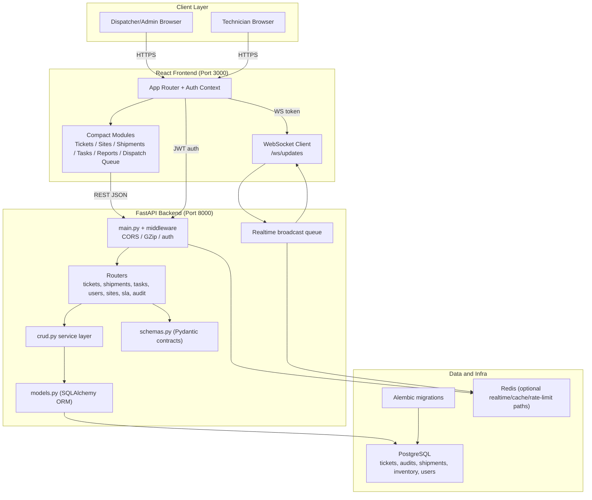

# Ticketing System

A comprehensive ticketing and inventory management system built with FastAPI and React.

## Quick Start

### Using the Startup Scripts (Recommended)

The easiest way to manage the application is using the provided scripts:

#### Start the Application
```bash
./start_app.sh
```

Start in development mode (backend reload + frontend HMR):
```bash
APP_MODE=dev ./start_app.sh
```

Start in production mode (backend workers + static frontend):
```bash
APP_MODE=prod ./start_app.sh
```

This script will:
- ✅ Kill any existing processes on ports 8000 and 3000
- ✅ Activate the Python virtual environment
- ✅ Install/update Python dependencies
- ✅ Start the backend server on port 8000
- ✅ Build the frontend if needed
- ✅ Start the frontend server on port 3000
- ✅ Monitor both servers and restart if they crash
- ✅ Provide colored status output

#### Stop the Application
```bash
./stop_app.sh
```

This script will:
- ✅ Gracefully stop both backend and frontend servers
- ✅ Force kill any remaining processes if needed
- ✅ Clean up temporary files

#### Restart the Application
```bash
./restart_app.sh
```

Restart in development mode:
```bash
./restart_app.sh dev
```

This script will:
- ✅ Stop the current application
- ✅ Wait for cleanup
- ✅ Start the application fresh

### Manual Startup (Alternative)

If you prefer to start services manually:

#### Backend
```bash
cd backend
source ../venv/bin/activate
uvicorn main:app --host 0.0.0.0 --port 8000 --reload
```

#### Frontend (dev mode with HMR)
```bash
cd frontend
npm install
npm start
```

#### Frontend (prod static build)
```bash
cd frontend
npm install
npm run build
npx serve -s build -l 3000 --single
```

## Deployment context

- **Same server**: Frontend and backend run on the same machine (backend on 8000, frontend on 3000 or static build).
- **LAN only**: The app is used only by PCs on the same local network; it is not accessed directly from the server or from the internet. All URLs below use the server’s LAN IP (e.g. 192.168.43.50).

## Access URLs

- **Frontend**: `http://<server-lan-ip>:3000` (e.g. http://192.168.43.50:3000)
- **Backend API**: `http://<server-lan-ip>:8000`
- **API Documentation**: `http://<server-lan-ip>:8000/docs`

Ensure `CORS_ORIGINS` in `.env` includes your frontend origin (e.g. `http://192.168.43.50:3000`). The frontend uses the same host as the page, so API and WebSocket URLs follow the address you use in the browser.

## Architecture Diagram



### Workflow Architecture Notes

- Core ticket lifecycle uses simple `status`: `open`, `completed`, `archived`.
- Operational state uses `workflow_state` for queues and day-to-day handling (`scheduled`, `onsite`, `offsite`, `needstech`, `goback_required`, NRO phase states, etc.).
- Dispatcher/admin tools consume workflow queues from backend endpoints and drive state transitions through dedicated workflow APIs.
- Ticket updates use optimistic concurrency (`ticket_version` + `expected_ticket_version`) to prevent user collisions.
- Audit timeline captures key workflow and return actions for accountability and reporting.

## Build Output and Locations

### Frontend (React)
- Build command: `cd frontend && npm run build`
- Served from: `frontend/build` (static)
- Key files:
  - `frontend/build/index.html`
  - `frontend/build/static/js/main.*.js`
  - `frontend/build/static/css/main.*.css`
- Local dev server command: `npx serve -s build -l 3000 --single`

### Backend (FastAPI)
- Entry point: `backend/main.py`
- Routers: `backend/routers/*.py` (tickets, sites, users, shipments, inventory, fieldtechs, fieldtech_companies, tasks, sla, audit, search)
- Schemas: `backend/schemas.py`
- Models: `backend/models.py`
- CRUD: `backend/crud.py`
- Auth utils: `backend/utils/auth.py`
- Operations runbook: `backend/OPERATIONS.md`

### WebSocket
- Endpoint: `ws://<backend-host>:8000/ws/updates?token=<JWT>`

## Frontend Components (New Compact Build)
- Tickets: `frontend/src/CompactTickets.js`, `frontend/src/CompactTicketDetail.js`, `frontend/src/CompactTicketFormComplete.js`, `frontend/src/components/CompactNewTicketStepper.js` (steps in `CompactNewTicketStepper/steps/`)
- Sites: `frontend/src/CompactSites.js`, `frontend/src/CompactSiteDetail.js`, `frontend/src/CompactSiteForm.js`
- Users: `frontend/src/CompactUsers.js`, `frontend/src/CompactUserForm.js`
- Tasks: `frontend/src/CompactTasks.js`, `frontend/src/CompactTaskForm.js`
- Shipments: `frontend/src/CompactShipments.js`, `frontend/src/CompactShipmentForm.js`
- Inventory: `frontend/src/CompactInventory.js`, `frontend/src/CompactInventoryForm.js`
- Field Techs: `frontend/src/CompactFieldTechs.js`, `frontend/src/CompactFieldTechForm.js`
- Field Tech Companies: `frontend/src/CompactFieldTechCompanies.js`, `frontend/src/CompactFieldTechCompanyForm.js`, `frontend/src/FieldTechMap.js`
- Dashboard: `frontend/src/components/CompactOperationsDashboard.js`

## Removed Legacy Forms
Legacy form components were removed in favor of compact forms:
- `frontend/src/TicketForm.js`
- `frontend/src/SiteForm.js`
- `frontend/src/UserForm.js`
- `frontend/src/InventoryForm.js`
- `frontend/src/TaskForm.js`
- `frontend/src/ShipmentForm.js`
- `frontend/src/FieldTechForm.js`

## Systemd Service (Optional)

To enable automatic startup on boot:

1. Copy the service file to systemd:
```bash
sudo cp ticketing-system.service /etc/systemd/system/
```

2. Reload systemd and enable the service:
```bash
sudo systemctl daemon-reload
sudo systemctl enable ticketing-system
```

3. Start the service:
```bash
sudo systemctl start ticketing-system
```

4. Check status:
```bash
sudo systemctl status ticketing-system
```

## Troubleshooting

### Port Already in Use
If you get "port already in use" errors:
```bash
# Kill all processes on specific ports
sudo lsof -ti:8000 | xargs kill -9
sudo lsof -ti:3000 | xargs kill -9
```

### Frontend Build Issues
If the frontend won't build:
```bash
cd frontend
rm -rf node_modules package-lock.json
npm install
npm run build
```

### Backend Issues
If the backend won't start:
```bash
cd backend
source ../venv/bin/activate
pip install -r ../requirements.txt
uvicorn main:app --host 0.0.0.0 --port 8000 --reload
```

### Database Issues
If you have database connection issues:
```bash
# Check if PostgreSQL is running
sudo systemctl status postgresql

# Start PostgreSQL if needed
sudo systemctl start postgresql
```

## Development

### Backend Development
```bash
cd backend
source ../venv/bin/activate
uvicorn main:app --host 0.0.0.0 --port 8000 --reload
```

### Frontend Development
```bash
cd frontend
npm start
```

## Testing

### How to run the app (summary)
- **Dev (recommended)**: `APP_MODE=dev ./start_app.sh` — backend with reload, frontend with HMR.
- **Prod-style**: `APP_MODE=prod ./start_app.sh` — backend workers, static frontend.
- **Manual**: Backend `cd backend && source ../venv/bin/activate && uvicorn main:app --host 0.0.0.0 --port 8000 --reload`; frontend `cd frontend && npm start`.

### How to run tests

**Backend (pytest)**  
From the project root with the venv activated:
```bash
cd backend
source ../venv/bin/activate
pip install -e ".[dev]"   # if not already (installs pytest, pytest-asyncio, httpx)
pytest
```
Or from repo root: `cd backend && source ../venv/bin/activate && pytest`

Tests live in `backend/tests/` (e.g. `test_auth.py`, `test_tickets.py`, `test_shipments.py`, `test_sla.py`). Use `pytest -v` for verbose output or `pytest path/to/test_file.py` to run a single file.

**Frontend (Jest / React Scripts)**  
From the project root:
```bash
cd frontend
npm install   # if not already
npm test
```
Runs Jest in watch mode by default. Use `CI=true npm test` for a single run (e.g. in CI).

## Features

- ✅ **Ticket Management**: Create, edit, and track support tickets
- ✅ **Workflow States**: Keep core status simple (`open`, `completed`, `archived`) while tracking operations with `workflow_state`
- ✅ **NRO Two-Phase Flow**: Track/schedule phase 1 and phase 2 independently
- ✅ **Inventory Management**: Track parts and equipment
- ✅ **User Management**: Role-based access control
- ✅ **Real-time Updates**: WebSocket integration
- ✅ **Audit Logging**: Track all changes
- ✅ **Reporting**: Analytics and performance metrics
- ✅ **Shipping Management**: Track shipments to sites
- ✅ **Field Tech Management**: Manage field technicians

## Configuration

The application uses environment variables for configuration. Key settings:

- `SECRET_KEY`: JWT secret key (must be >= 32 characters)
- `DATABASE_URL`: PostgreSQL connection string
- `BCRYPT_ROUNDS`: Password hashing rounds (default: 12)

## Support

For issues or questions, check the logs:
```bash
# Systemd service logs
sudo journalctl -u ticketing-system -f

# Startup script logs
tail -f backend_uvicorn.log
tail -f frontend_serve.log
``` 